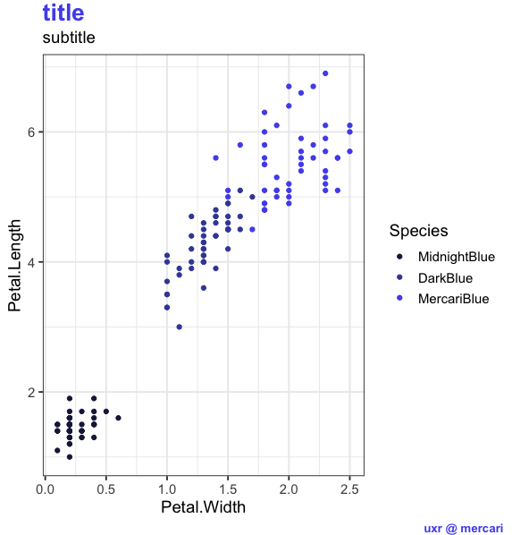

# ggmercari

Mercari themes for ggplot2!

## How to install

In RStudio Console:
```
install.packages('devtools')
library(devtools)
install_github("mcmahonmc/ggmercari")
```

## Example

```
library(tidyverse)

p <- ggplot(iris, aes(x = Petal.Width, y = Petal.Length, color = Species)) + 
+     geom_point()

p + ggmercari::ggmercari()
```

